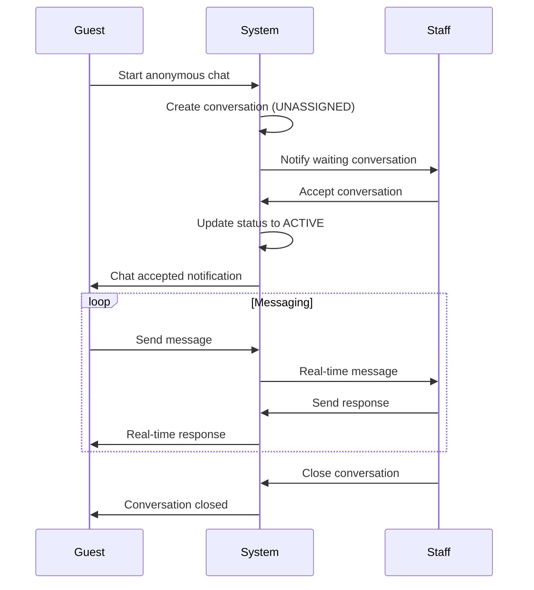
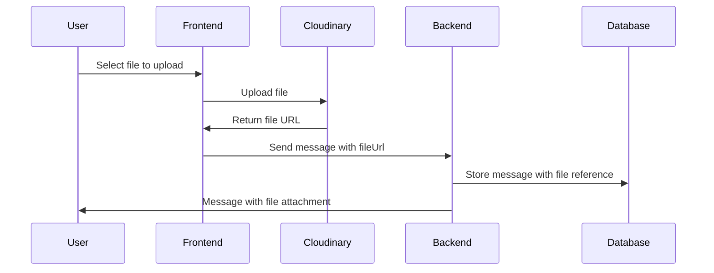

# 📱 Chat System Documentation

**OEM EV Warranty Management System**  
**Date**: October 28, 2025  
**Version**: 1.0.0  
**Status**: ✅ Core Features Complete | ⚠️ File Upload Partial

---

## 🎯 **Overview**

The chat system provides **real-time customer support** functionality, enabling guests to communicate with service center staff through anonymous chat sessions. The system supports live messaging, conversation management, and file sharing capabilities.

### **Key Features**

- ✅ Anonymous guest chat initiation
- ✅ Staff conversation acceptance and management
- ✅ Real-time messaging with Socket.io
- ✅ Typing indicators
- ✅ Conversation history and pagination
- ✅ File upload support (frontend ready, backend partial)
- ✅ Role-based access control
- ✅ Multi-language support (Vietnamese/English)

---

## 🏗️ **Architecture**

### **Technology Stack**

- **Backend**: Node.js + Express.js
- **Real-time**: Socket.io v4.8.1
- **Database**: MySQL with Sequelize ORM
- **File Storage**: Cloudinary (for uploads)
- **Frontend**: Next.js + React + Socket.io-client
- **Authentication**: JWT with role-based middleware

### **System Components**

```
┌─────────────────┐    ┌─────────────────┐    ┌─────────────────┐
│   Guest User    │    │  Service Staff  │    │   WebSocket     │
│                 │    │                 │    │   Server        │
│ • Start Chat    │◄──►│ • Accept Chat   │◄──►│ • Real-time     │
│ • Send Messages │    │ • Send Messages │    │   messaging     │
│ • Upload Files  │    │ • Close Chat    │    │ • Typing        │
└─────────────────┘    └─────────────────┘    │   indicators   │
                                              └─────────────────┘
                                                     │
                                                     ▼
┌─────────────────┐    ┌─────────────────┐    ┌─────────────────┐
│   REST APIs     │    │   Database      │    │   Cloudinary    │
│                 │    │                 │    │                 │
│ • Conversations │───►│ • conversations │    │ • File uploads  │
│ • Messages      │    │ • messages      │    │ • Image storage │
│ • File Upload   │    │ • guests        │    │                 │
└─────────────────┘    └─────────────────┘    └─────────────────┘
```

---

## 📡 **API Endpoints**

### **Base URL**: `/api/v1/chat`

### **1. Start Anonymous Chat**

```http
POST /chat/start-anonymous-chat
Content-Type: application/json

{
  "guestId": "guest_1234567890_abc123def",
  "serviceCenterId": "service-center-uuid"
}
```

**Response:**

```json
{
  "status": "success",
  "data": {
    "conversation": {
      "id": "conv-uuid",
      "guestId": "guest-uuid",
      "status": "UNASSIGNED",
      "createdAt": "2025-10-28T10:00:00Z"
    }
  }
}
```

### **2. Accept Conversation (Staff Only)**

```http
PATCH /chat/conversations/{conversationId}/accept
Authorization: Bearer {jwt-token}
```

**Response:**

```json
{
  "status": "success",
  "data": {
    "conversation": {
      "conversationId": "conv-uuid",
      "staffId": "staff-uuid",
      "status": "ACTIVE",
      "acceptedAt": "2025-10-28T10:05:00Z"
    }
  }
}
```

### **3. Get Conversation Messages**

```http
GET /chat/conversations/{conversationId}/messages?limit=50&offset=0
```

**Response:**

```json
{
  "status": "success",
  "data": {
    "messages": [
      {
        "messageId": "msg-uuid",
        "content": "Tôi muốn hỏi về chính sách bảo hành",
        "senderId": "guest-uuid",
        "senderType": "GUEST",
        "senderName": "Nguyễn Văn A",
        "sentAt": "2025-10-28T10:00:00Z",
        "isRead": true,
        "fileUrl": null,
        "fileType": null
      }
    ],
    "pagination": {
      "total": 25,
      "limit": 50,
      "offset": 0
    }
  }
}
```

### **4. Get Staff Conversations**

```http
GET /chat/my-conversations?status=active&limit=20&offset=0
Authorization: Bearer {jwt-token}
```

**Response:**

```json
{
  "status": "success",
  "data": {
    "conversations": [
      {
        "conversationId": "conv-uuid",
        "guest": {
          "guestId": "guest-uuid",
          "name": "Nguyễn Văn A"
        },
        "status": "ACTIVE",
        "lastMessage": {
          "content": "Cảm ơn bạn đã hỗ trợ",
          "sentAt": "2025-10-28T10:10:00Z"
        },
        "unreadCount": 0,
        "createdAt": "2025-10-28T10:00:00Z"
      }
    ],
    "pagination": {
      "total": 15,
      "limit": 20,
      "offset": 0
    }
  }
}
```

### **5. Close Conversation (Staff Only)**

```http
PATCH /chat/conversations/{conversationId}/close
Authorization: Bearer {jwt-token}
```

**Response:**

```json
{
  "status": "success",
  "data": {
    "conversation": {
      "conversationId": "conv-uuid",
      "status": "CLOSED",
      "closedAt": "2025-10-28T10:15:00Z",
      "closedBy": "staff-uuid"
    }
  }
}
```

---

## 🔌 **Real-time Features (Socket.io)**

### **Namespaces**

- **`/chats`** - Chat messaging (optional auth for guests)
- **`/notifications`** - System notifications (authenticated users only)

### **Chat Events**

#### **Connection & Room Management**

```javascript
// Join conversation room
socket.emit("joinRoom", { conversationId: "conv-uuid" });

// Leave conversation room
socket.emit("leaveRoom", { conversationId: "conv-uuid" });
```

#### **Messaging**

```javascript
// Send message
socket.emit(
  "sendMessage",
  {
    conversationId: "conv-uuid",
    senderId: "user-uuid",
    senderType: "STAFF", // or 'GUEST'
    content: "Hello, how can I help you?",
  },
  (acknowledgment) => {
    if (acknowledgment.success) {
      console.log("Message sent successfully");
    } else {
      console.error("Failed to send message:", acknowledgment.error);
    }
  }
);

// Receive new message
socket.on("newMessage", (data) => {
  console.log("New message:", data.newMessage);
  console.log("Sent at:", data.sendAt);
});
```

#### **Typing Indicators**

```javascript
// Send typing indicator
socket.emit("typing", { conversationId: "conv-uuid" });

// Receive typing indicator
socket.on("userTyping", (data) => {
  console.log(`${data.userId} is typing...`);
});
```

#### **System Events**

```javascript
// Chat accepted by staff
socket.on("chatAccepted", (data) => {
  console.log("Chat accepted by staff:", data.staffId);
});

// Conversation closed
socket.on("conversationClosed", (data) => {
  console.log("Conversation closed by:", data.closedBy);
});

// Error handling
socket.on("messageError", (data) => {
  console.error("Message error:", data.error);
});
```

### **Notification Events**

```javascript
// Listen for system notifications
socket.on("newConversation", (data) => {
  console.log("New conversation waiting:", data.conversationId);
});

socket.on("stockTransferRequest", (data) => {
  console.log("New stock transfer request:", data.requestId);
});
```

---

## 📎 **File Upload Feature**

### **⚠️ Current Status: Partially Implemented**

**✅ Frontend**: Complete file upload UI and Cloudinary integration
**❌ Backend**: Missing database fields and API support

### **Frontend Implementation**

```typescript
// File upload to Cloudinary
const uploadFile = async (file: File) => {
  const formData = new FormData();
  formData.append("file", file);

  const response = await fetch("/api/upload", {
    method: "POST",
    body: formData,
  });

  const { url, public_id } = await response.json();
  return { url, public_id };
};
```

### **Message Interface (Frontend Ready)**

```typescript
interface Message {
  messageId: string;
  content: string;
  senderId: string;
  senderType: "guest" | "staff";
  senderName: string;
  sentAt: string;
  isRead: boolean;
  fileUrl?: string; // ✅ Frontend ready
  fileType?: "image" | "file"; // ✅ Frontend ready
}
```

### **Backend Missing Implementation**

```sql
-- Add to message table
ALTER TABLE message ADD COLUMN file_url VARCHAR(500);
ALTER TABLE message ADD COLUMN file_type ENUM('image', 'file');
```

---

## 🔐 **Authentication & Authorization**

### **Guest Access (No Authentication)**

- Start anonymous chat
- Send/receive messages in their conversation
- View conversation history

### **Staff Access (JWT Required)**

- Accept waiting conversations
- Send/receive messages
- Close conversations
- View conversation list
- Access staff dashboard

### **Role-Based Permissions**

```javascript
// Service Center Staff
- Accept conversations from service_center_staff_{serviceCenterId} room
- Manage conversations assigned to them

// Service Center Manager
- View all conversations in their service center
- Access manager dashboard

// Service Center Technician
- Receive notifications about assigned tasks
- Access technician dashboard
```

---

## 💾 **Database Schema**

### **Conversations Table**

```sql
CREATE TABLE conversation (
  id VARCHAR(36) PRIMARY KEY DEFAULT (UUID()),
  guest_id VARCHAR(36) NOT NULL,
  staff_id VARCHAR(36) NULL,
  status ENUM('UNASSIGNED', 'ACTIVE', 'CLOSED') NOT NULL DEFAULT 'UNASSIGNED',
  last_message_at TIMESTAMP NULL,
  created_at TIMESTAMP DEFAULT CURRENT_TIMESTAMP,
  updated_at TIMESTAMP DEFAULT CURRENT_TIMESTAMP ON UPDATE CURRENT_TIMESTAMP,
  FOREIGN KEY (guest_id) REFERENCES guest(id),
  FOREIGN KEY (staff_id) REFERENCES user(id)
);
```

### **Messages Table**

```sql
CREATE TABLE message (
  id VARCHAR(36) PRIMARY KEY DEFAULT (UUID()),
  conversation_id VARCHAR(36) NOT NULL,
  sender_id VARCHAR(36) NOT NULL,
  sender_type ENUM('GUEST', 'STAFF') NOT NULL,
  content TEXT NOT NULL,
  is_read BOOLEAN DEFAULT FALSE,
  -- TODO: Add file support
  -- file_url VARCHAR(500) NULL,
  -- file_type ENUM('image', 'file') NULL,
  created_at TIMESTAMP DEFAULT CURRENT_TIMESTAMP,
  updated_at TIMESTAMP DEFAULT CURRENT_TIMESTAMP ON UPDATE CURRENT_TIMESTAMP,
  FOREIGN KEY (conversation_id) REFERENCES conversation(id)
);
```

### **Guests Table**

```sql
CREATE TABLE guest (
  id VARCHAR(36) PRIMARY KEY DEFAULT (UUID()),
  name VARCHAR(255) NULL,
  created_at TIMESTAMP DEFAULT CURRENT_TIMESTAMP
);
```

---

## 🎨 **UI Components**

### **Frontend Components**

- **`GuestChatWidget.tsx`** - Anonymous chat interface for customers
- **`StaffChatDashboard.tsx`** - Staff conversation management
- **`ChatMessage.tsx`** - Individual message display
- **`FileUpload.tsx`** - File attachment component
- **`TypingIndicator.tsx`** - Real-time typing feedback

### **Key Features**

- **Responsive Design** - Works on mobile and desktop
- **Real-time Updates** - Instant message delivery
- **File Previews** - Image thumbnails and file icons
- **Message Status** - Read/unread indicators
- **Auto-scroll** - New messages keep chat in view
- **Emoji Support** - Rich text formatting

---

## 🔄 **Workflow Examples**

### **Guest Support Flow**



### **File Upload Flow**



---

## ⚠️ **Known Issues & Limitations**

### **Current Limitations**

1. **No Internal Staff Messaging** - Only guest-staff conversations supported
2. **File Upload Backend Incomplete** - Frontend ready, backend needs database fields
3. **No Message Encryption** - Messages stored in plain text
4. **No Message History Export** - No way to export conversation history
5. **Limited Offline Support** - No offline message queuing

### **Performance Considerations**

- **Message Pagination** - Large conversations may need optimization
- **File Size Limits** - No file size restrictions implemented
- **Concurrent Connections** - Socket.io scaling considerations
- **Database Indexing** - May need indexes on conversation_id, created_at

---

## 🚀 **Future Enhancements**

### **High Priority**

- [ ] Complete file upload backend implementation
- [ ] Add message read receipts
- [ ] Implement message search functionality
- [ ] Add conversation transfer between staff members

### **Medium Priority**

- [ ] Internal staff messaging system
- [ ] Chat analytics and reporting
- [ ] Message templates for common responses
- [ ] Voice message support

### **Low Priority**

- [ ] Chatbots for automated responses
- [ ] Multi-language translation
- [ ] Video call integration
- [ ] Chat history export functionality

---

## 🧪 **Testing**

### **API Testing**

```bash
# Start anonymous chat
curl -X POST http://localhost:3000/api/v1/chat/start-anonymous-chat \
  -H "Content-Type: application/json" \
  -d '{"guestId": "test-guest", "serviceCenterId": "sc-uuid"}'

# Get messages
curl http://localhost:3000/api/v1/chat/conversations/{id}/messages
```

### **Socket Testing**

```javascript
// Connect to chat namespace
const socket = io("/chats");

// Test messaging
socket.emit("joinRoom", { conversationId: "test-conv" });
socket.emit("sendMessage", {
  conversationId: "test-conv",
  senderId: "test-user",
  senderType: "STAFF",
  content: "Test message",
});
```

---

## 📞 **Support & Maintenance**

### **Monitoring**

- Socket connection health
- Message delivery success rates
- File upload success/failure rates
- Conversation response times

### **Logs**

```javascript
// Chat service logs
console.log(`Chat accepted: ${conversationId} by ${staffId}`);

// Socket logs
console.log(`User ${socket.id} joined room: conversation_${conversationId}`);
```

### **Error Handling**

- Network disconnection recovery
- Message delivery failures
- File upload errors
- Authentication failures

---

## 📚 **Related Documentation**

- [API Documentation](/api-docs) - Swagger UI
- [Frontend Components](../FE/web-app/src/components/chat/)
- [Socket Implementation](../BE/src/socket/socket.js)
- [Database Migrations](../BE/migrations/)
- [Authentication Guide](./AUTHENTICATION.md)

---

**Last Updated**: October 28, 2025  
**Version**: 1.0.0  
**Maintainer**: Development Team
</content>
<parameter name="filePath">c:\Users\Admin\Documents\GitHub\OEMEVWarrantyManagementSystemWDP\CHAT_SYSTEM_DOCUMENTATION.md
